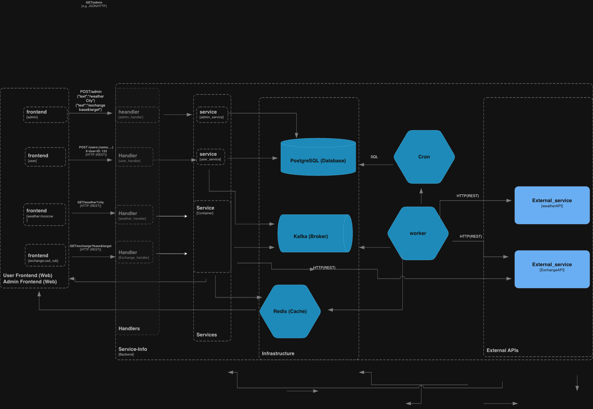

# 🚀 Service Info

Сервис для агрегации и доставки актуальной информации:

- погода в реальном времени
- Курсы валют
- Популярные запросы пользователей
- Полностью развёртывается локально одной командой.

---

## Проблема и решение

### Продуктовая проблема

Пользователи сталкиваются с необходимостью получать актуальные данные из разных источников:

- Погода — для планирования мероприятий, логистики, аналитики;
- Курсы валют — для финансовых расчётов и отчётов;

**Традиционные подходы** (прямые синхронные вызовы к внешним API) приводят к:

- высокой задержке,
- нестабильности (падение одного API = падение всего сервиса),
- невозможности кэшировать или предварительно обрабатывать данные.

---

### Техническая проблема

Существующие реализации часто:

- не масштабируются,
- не обеспечивают отказоустойчивость (отсутствие кэширования);
- сложно расширяются (добавление новых источников требует глубокой переработки кода).

---

### Как `service-info` решает эти проблемы

**Продуктовый**

- Единый API быстрый ответ (из кэша) даже при падении внешних API

**Технический**

- Event-driven архитектура: Kafka + Redis + Go workers
- Отказоустойчивость: кэш живёт 5–60 мин
- Масштабируемость: новый источник = новый топик + воркер

---

## Архитектура



## Требования

- Docker
- Docker Compose
- git

Зависимости Go, PostgreSQL, Kafka и т.д. устанавливаются автоматически в контейнерах.

---

## Быстрый старт

```bash
# 1. Клонируйте репозиторий
git clone https://github.com/Alex2792D/service-info.git
cd service-info
# 2. Скопируйте шаблон конфигурации и вставьте ключи
cp .env.example .env
3. Запуск контеинера
docker compose up -d
4. Логи приложения
 docker compose logs -f app
5. Остановить контейнеры
 docker compose down
```

## Тестовые ключи

  <details>
  WEATHERAPI_KEY=622256b9dda24a82b29124055252801
  FREECURRENCY_API_KEY=fca_live_ufym9fxsdW5Qz8zVSChBpGY7j6XZtAQnKc0mupAE
  </details>
